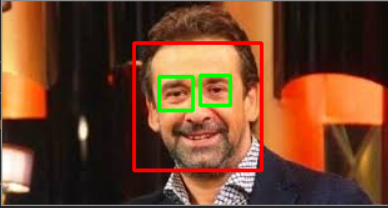

# Computer-Vision_Face_Detection-
Using OpenCV &amp; Python 
#### For the run

Enter the path of your photo after run the Notebook
# Face Recognition

## Features

#### Find faces in pictures

Find all the faces that appear in a picture:

 
 ## For Run the project
 
 Enter the path of your project after start tha application
